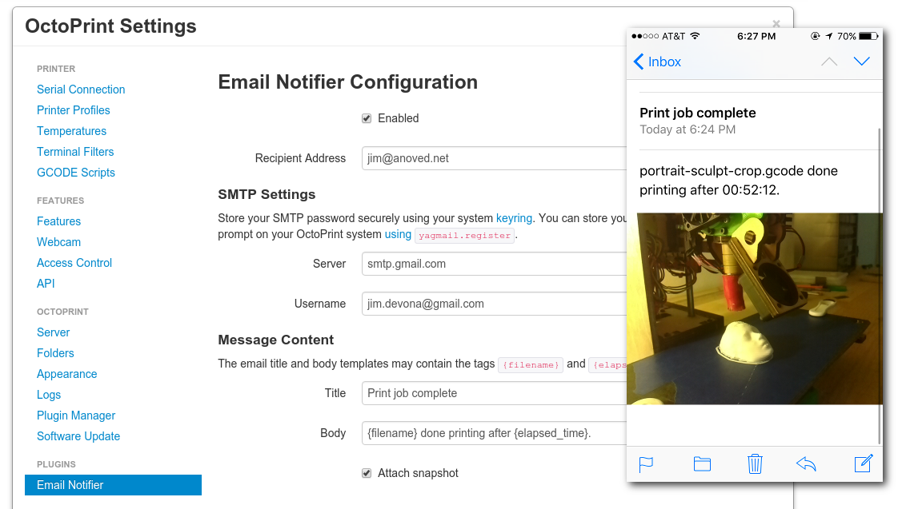

# OctoPrint-EmailNotifier

Recieve email notifications when OctoPrint jobs are STARTED, COMPLETED, FAILED or CANCELLED.

*   Forked from ericli1018/OctoPrint-EmailNotifier which is forked from anov/OctoPrint-EmailNotifier

## Installation

Install via the OctoPrint [Plugin Manager](https://github.com/foosel/OctoPrint/wiki/Plugin:-Plugin-Manager) or manually using this [archive URL](https://github.com/kotl/OctoPrint-EmailNotifier/archive/master.zip):

	https://github.com/kotl/OctoPrint-EmailNotifier/archive/master.zip

## Configuration

Your outgoing email account password is not stored with OctoPrint's settings. It is retrieved from your system [keyring](https://pypi.python.org/pypi/keyring#what-is-python-keyring-lib). Store your password from a Python prompt on your OctoPrint system using [`yagmail.register`](https://github.com/kootenpv/yagmail#username-and-password): 

	$ ~/oprint/bin/python
	>>> import yagmail
	>>> yagmail.register("SMTP username", "SMTP password")

For some accounts, your SMTP username may be your complete `username@domain.com` address.

To use yagmail (and thus OctoPrint-EmailNotifier) with Gmail, you may need to [allow less secure apps to access your account](https://support.google.com/accounts/answer/6010255?hl=en).

## Acknowledgements

Loosely based on [OctoPrint-Pushbullet](https://github.com/OctoPrint/OctoPrint-Pushbullet). 

Uses [yagmail](https://github.com/kootenpv/yagmail) to send email.

## License

Licensed under the terms of the [AGPLv3](http://opensource.org/licenses/AGPL-3.0).
